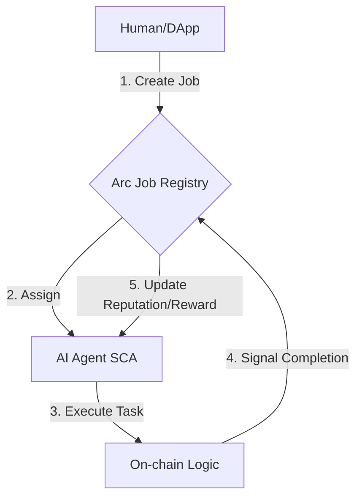

# ARC ERC-8183 Job Demo: Smart Accounts & USDC Gas

[](https://docs.arc.network)
[](https://github.com/ethereum/ERCs/pull/8183)
[](https://opensource.org/licenses/MIT)

A comprehensive end-to-end demonstration of the **ERC-8183** (Agent Job Protocol) lifecycle on **Arc Testnet**. This project showcases how AI agents (simulated via wallets) interact using **Circle Smart Contract Accounts (SCA)** with **USDC** functioning as both the gas token and the payment currency.


## 🚀 Why This Project?

Most blockchain agent examples are limited to simple asset transfers. This repository demonstrates a **full commercial workflow** required for real-world agent economies:
* **Programmable Escrow:** Payments are locked securely until job completion.
* **Role Separation:** Roles (**Client**, **Provider**) are simulated via separate smart accounts (**not autonomous agents**).
* **Native USDC Gas:** Leveraging Arc's unique architecture where USDC covers gas fees, removing the need for native ETH/ARC tokens.

## 🧠 The Mental Model (ERC-8183)

The lifecycle follows a strict state machine to ensure trustless execution:
1.  **OPEN:** Client creates a job description.
2.  **BUDGETED:** Provider sets the required budget/cost.
3.  **FUNDED:** Client locks USDC into the job escrow.
4.  **SUBMITTED:** Provider delivers the work/data.
5.  **COMPLETED:** Client evaluates and releases payment to the Provider.


## 🏗️ Job Lifecycle Architecture



## ⚙️ Setup & Installation
**1. Prerequisites**

Node.js ≥ v22

Circle Developer Account: Get API Key

Entity Secret: Generated for Circle's Programmable Wallets.

**2. Installation**
```
git clone https://github.com/Thanhdatne/arc-erc8183-job-demo.git
cd arc-agent-smart-account-erc8183
npm install
```

**3. Configuration**
**Create a .env file from the example:**

```
cp .env.example .env
```
**Fill in your credentials:**

```
CIRCLE_API_KEY=your_circle_api_key
CIRCLE_ENTITY_SECRET=your_32_byte_hex_secret
```

## 🧾 Usage Guide

**Step 1: Run the Job**

Execute the automated end-to-end flow from job creation to final payment settlement.

```
npm run job
```

### Step 2: Fund the Client

The program will pause to allow you to top up your client wallet using Arc Testnet **USDC**

The Client requires **USDC** on Arc Testnet for gas and escrow payments.

* **Faucets:** [Circle Faucet](https://faucet.circle.com) or [Console Faucet](https://console.circle.com/faucet)
* **Token:** `USDC` (Arc Testnet)
* **💡 Note:** Ensure the Client wallet has at least **10-20 USDC** to cover both gas fees and job costs.


## ⚠️ Key Insights

USDC Decimals: On Arc, USDC uses 6 decimals. The script handles this conversion, but be mindful when manual funding.

Atomic vs. Async: This script runs sequentially for demo purposes. In a real production environment, agents would use event listeners to react to state changes.

Gas Abstraction: Notice that neither wallet needs native ARC tokens. The Arc Network enables seamless USDC-as-gas experiences via Circle's SCA.


## 🔗 Resources

* [Arc Network Documentation](https://docs.arc.network) - Learn more about Arc's architecture and USDC as gas.
* [Circle Programmable Wallets](https://developers.circle.com/w3s/docs/programmable-wallets) - Explore Circle's SCA and W3S infrastructure.
* [ERC-8183 Specification](https://github.com/ethereum/ERCs/pull/8183) - Technical details of the Agent Job Protocol.
